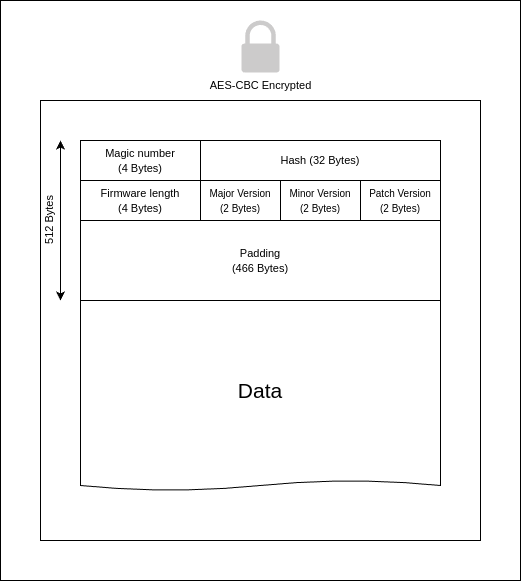

# STM32F405 Secure Bootloader

A secure bootloader implementation for STM32F405 microcontroller with encrypted firmware updates and secure communication.

## Key Features

### Communication Interfaces
- **Dual Interface Support**: 
  - USB Communication
  - UART Communication

### Security Features
- **Secure Key Exchange**:
  - Implements ECDH (Elliptic Curve Diffie-Hellman) key exchange
  - Two-step handshake process (X and Y coordinates)
  - Uses public key cryptography for initial key establishment

- **Encrypted Communication**:
  - AES encryption for packet data
  - IV (Initialization Vector) management for secure encryption
  - Packet validation with checksums
  - Secure firmware update process

### Firmware Update Features
- **Flash Operations**:
  - Secure flash erase functionality
  - Encrypted firmware writing
  - Flash read capability
  - Firmware header validation

### System Commands
- **Device Management**:
  - Get Device UID command
  - System reset capability
  - Jump to application command
  - LED toggle for visual feedback
  - Flashing completion handling

### Safety Features
- **Error Handling**:
  - Checksum validation
  - Header validation
  - Error reporting through ACK/NACK system
  - Safe state management during updates

### Protocol Features
- **Packet Structure**:
  - 64-byte packet size
  - Start ('>')and end ('<') markers
  - Command byte
  - Length byte
  - Payload data
  - Checksum validation

## Firmware Header Structure

